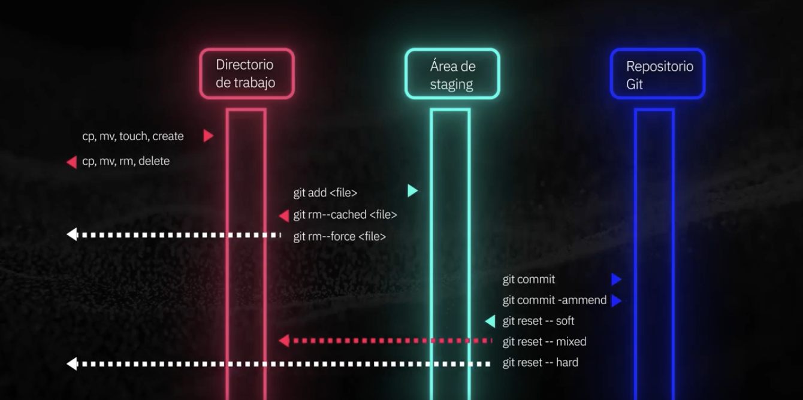

# Git and GitHub

## Main commands
`git init` creates a hidden folder to start the repository <br>
`git status` shows the status of the changes <br>
`git log` shows all the records of the changes <br>
`git add .` adds the files of the current folder to be committed -> staging state <br>
`git commit -m "Update 1 on Jan 28, 2025"` Insert the changes in the repository <br> 





## Main as Default Branch

GitHub cambió su rama por defecto a main, antes se llamaba master, git aún sirve conservando la rama master por defecto. Al ser ramas diferentes, al querer hacer el push es muy probable que los cambios no se vean y te pasen cosas raras con tu repositorio. Para evitar esto tenemos dos soluciones: . 1.- Cambiar la rama por defecto de git a main (recomendado) . Para hacer esto (justo después del git init y ANTES del `git add`), estando en tu repositorio desde la terminal debes escribir el siguiente comando:

```bash
git checkout -b main
```
Esto establecerá tu rama por defecto como main y no tendrás problemas al subir tu código al repositorio. 


## Changing the name of the Branch from Master to Main

```bash
git branch -m master main
```

## Pushing a repository from Git to GitHub
On the current folder, after creating the SSH connection between the computer with the remote repository. Copy the reference of the repository, for example: `git@github.com:GustavoKaczmarek/courses-notes.git` and paste it together with this command
```bash
git remote add origin git@github.com:GustavoKaczmarek/courses-notes.git
```

Then you can display the names of the remote repositories (like 'origin') that you have configured for your local repository, along with their associated URLs.

```bash
git remote -v
```

The output might look like:
```plaintext
origin  git@github.com:username/repository.git (fetch)
origin  git@github.com:username/repository.git (push)
```

Finally with the command
```bash
git push -f origin main
```
We upload our local branch commits to our remote repository. `-f` or `--force` is telling Git to force push the changes. Typically `origin` refers to the main remote repository associated and `main` specifies the branch I am pushing to on the remote repository.
